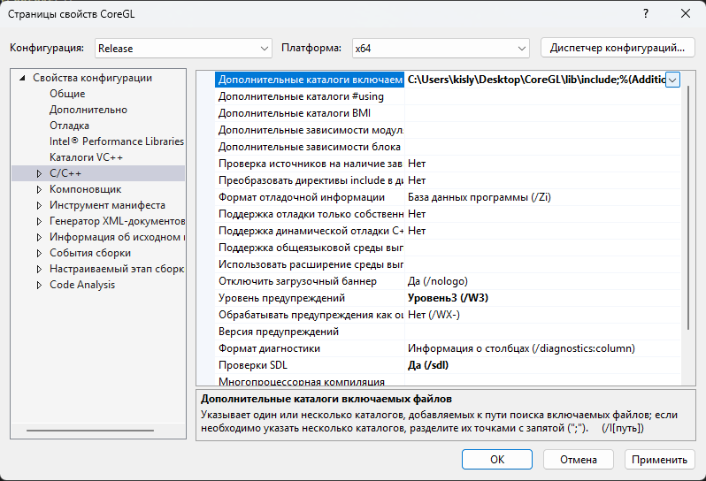
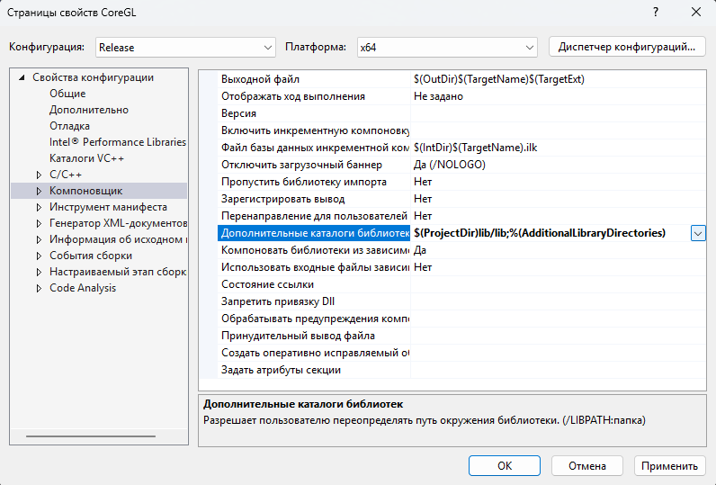
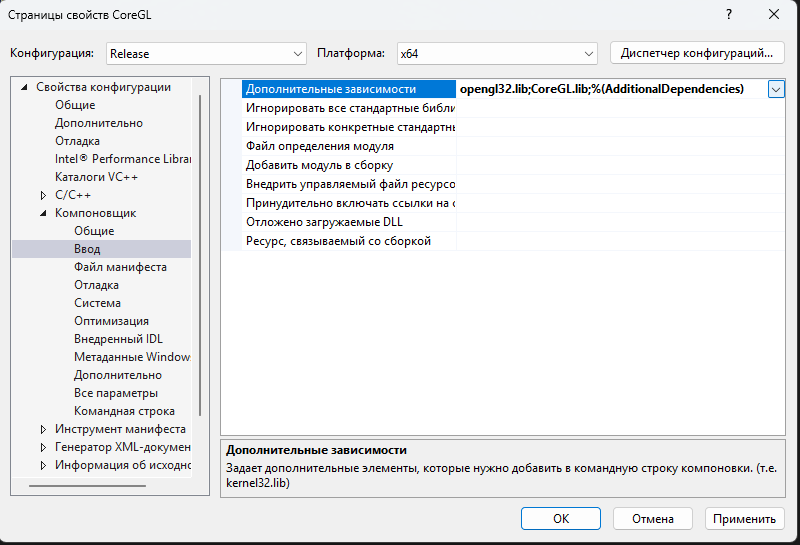

# CoreGL
CoreGL - это библиотека для создания 3D и 2D игр, приложений\
на базе OpenGL.

## Об CoreGL
>[!NOTE]
> Написана на c++ 20\
> Формат .lib\
> режим компилятора - release x64

## линковка для VS
1.Заходим в свойства проекта\
2.Прописываем путь к папке include\

3.Прописываем путь к папкe lib\

4.Прописываем зависимости\
coregl32.lib\
CoreGL.lib\

5.Закидываем папку res в папку с проектом,\
а в последсвии к файлу .exe
